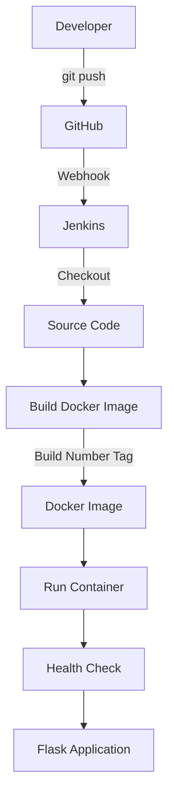

# Project 2 - Dockerized Flask CI/CD Pipeline

## Overview

A DevOps project demonstrating a complete CI/CD workflow using GitHub, Jenkins, Docker, and a Flask application.

The application is automatically built and deployed whenever code is pushed to the GitHub repository.

## Architecture

## Technologies

- Linux (Ubuntu 22.04)
- Git
- GitHub
- Jenkins
- Docker
- Python
- Flask
- ngrok

## Application

The Flask application provides:

- `/` - Application response
- `/health` - Health check endpoint

## CI/CD Pipeline

The Jenkins pipeline performs the following stages:

1. Checkout source code from GitHub
2. Build Docker image
3. Tag the image using the Jenkins build number
4. Stop and remove the previous container
5. Deploy the new container
6. Perform an application health check

Example Docker image:

    project-2-app:4

## Automatic Trigger

A GitHub webhook triggers the Jenkins pipeline whenever code is pushed to the `main` branch.

## Docker

Build manually:

    docker build -t project-2-app:1.0 .

Run manually:

    docker run -d --name project-2-container -p 5000:5000 project-2-app:1.0

## Application Testing

Test the application:

    curl http://localhost:5000

Test the health endpoint:

    curl http://localhost:5000/health

Expected health response:

    OK

## Jenkinsfile

The Jenkins pipeline is stored in the repository as code in:

    Jenkinsfile

This allows the CI/CD configuration to be version-controlled along with the application.

## Project Outcome

This project demonstrates:

- Git-based source control
- GitHub webhook integration
- Jenkins Pipeline as Code
- Docker image creation
- Versioned Docker images
- Automated container deployment
- Automated application health checks
